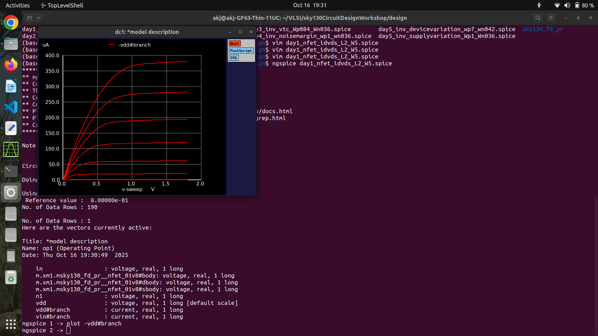
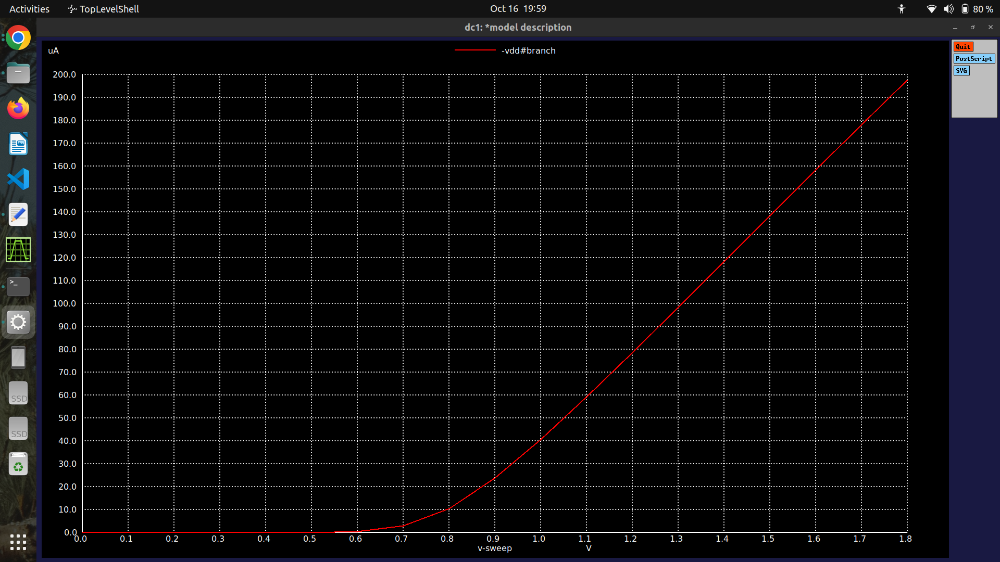
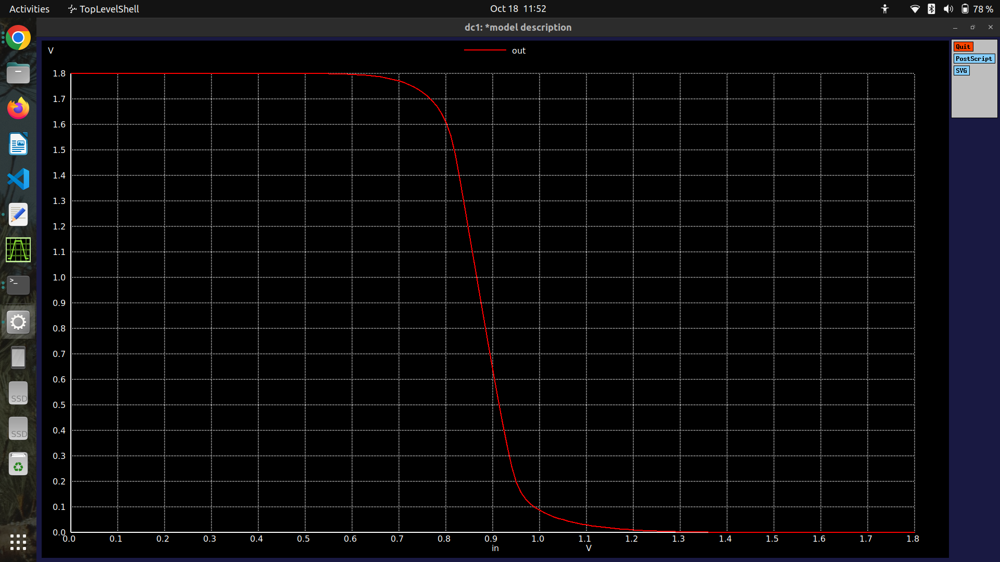
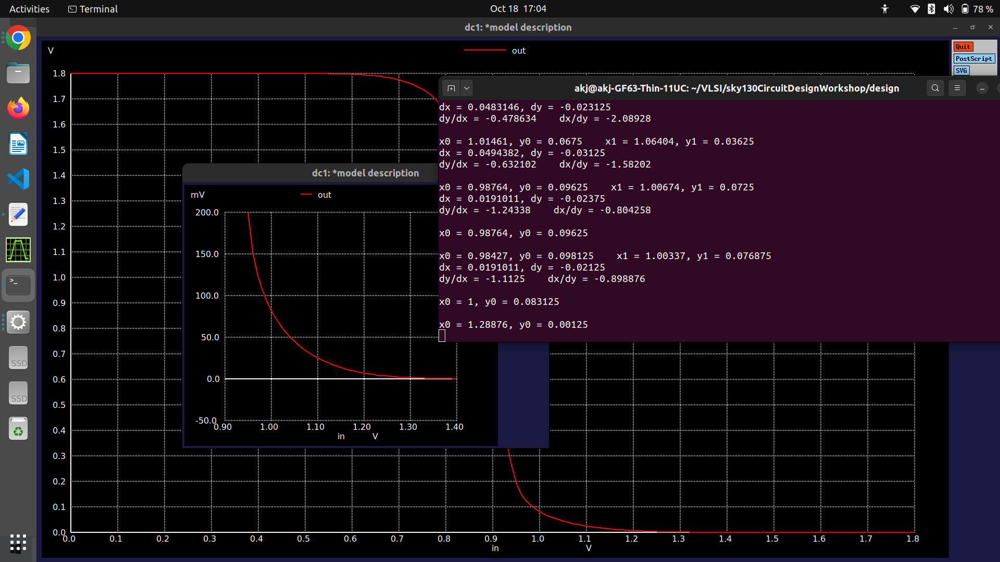
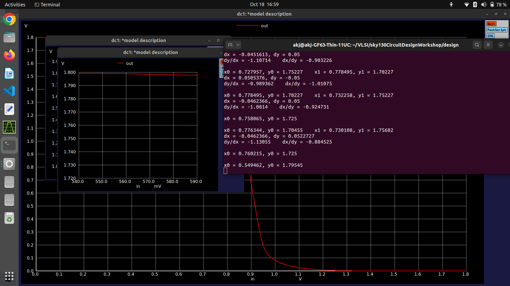
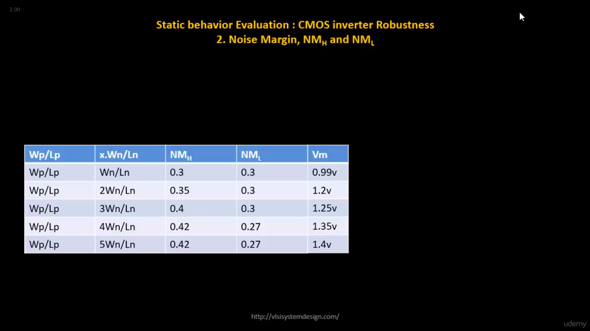
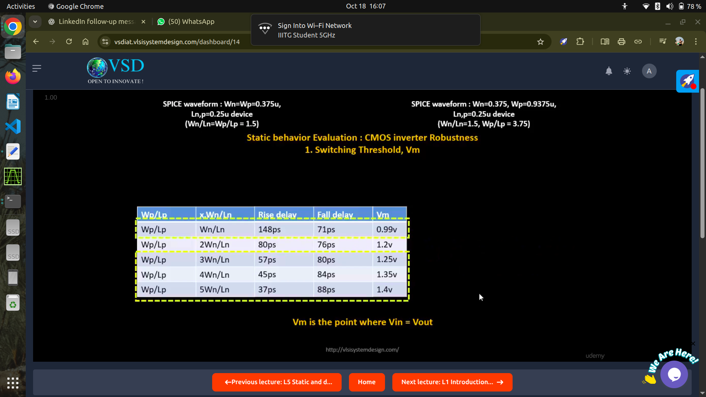
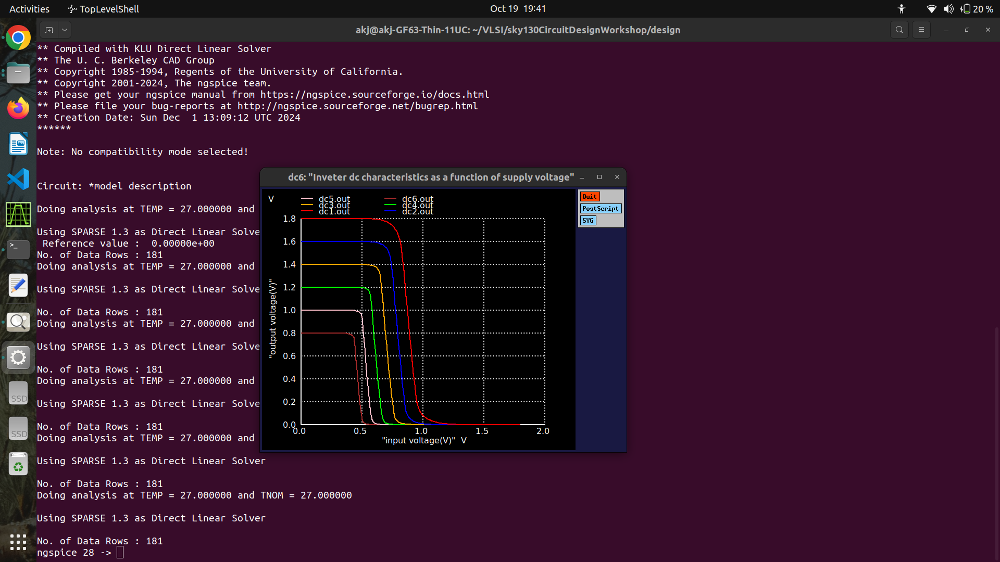
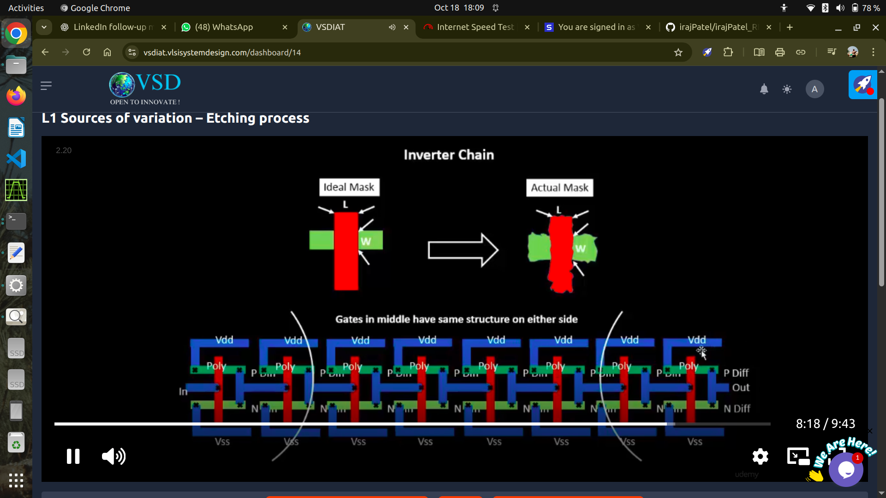
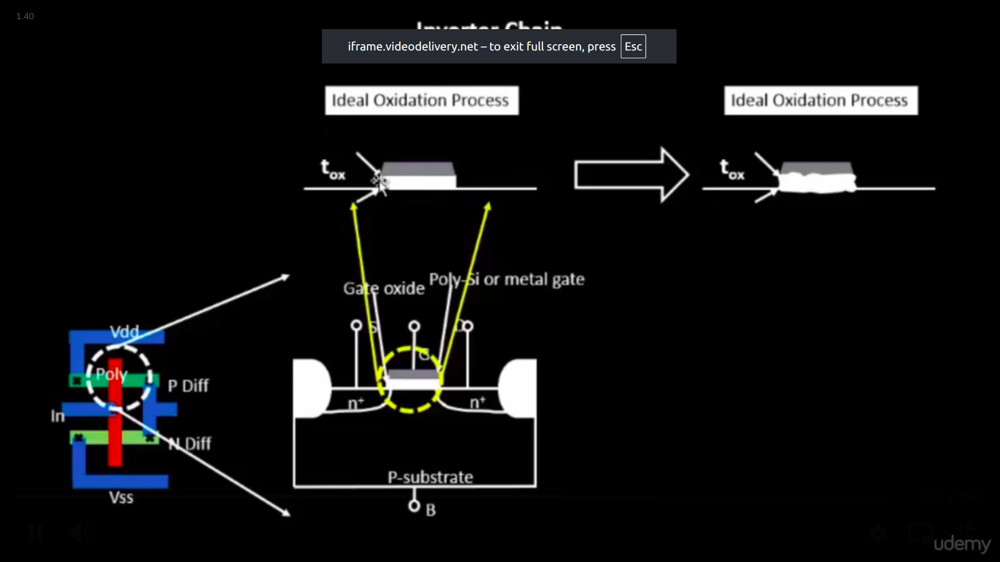

# In-Depth Analysis of MOSFET and CMOS Inverter Characteristics

This repository presents a detailed characterization of N-channel MOSFETs and a standard CMOS inverter through a series of simulations. The goal is to provide a thorough understanding of the fundamental principles governing transistor behavior and how these principles translate into the static and dynamic performance of a digital logic gate. We explore the impact of gate voltage, device sizing (W/L ratio), and supply voltage on performance metrics.

---

## Table of Contents
1.  [Long-Channel MOSFET I-V Characteristics](#1-long-channel-mosfet-i-v-characteristics-ids-vs-vds-)
2.  [Short-Channel Effects: Velocity Saturation](#2-short-channel-effects-velocity-saturation-a-new-limit-on-current-)
3.  [CMOS Inverter Voltage Transfer Characteristic (VTC)](#3-cmos-inverter-voltage-transfer-characteristic-vtc-a-regional-analysis-)
4.  [Noise Margin ($NM_H$ & $NM_L$) Calculation](#4-noise-margin-nm_h--nm_l-quantifying-robustness-)
5.  [Impact of Device Sizing (W/L) on VTC](#5-impact-of-device-sizing-wl-on-vtc-the-transistor-strength-battle-)
6.  [Impact of Device Sizing (W/L) on Transient Response](#6-impact-of-device-sizing-wl-on-transient-response-rise-and-fall-dynamics-)
7.  [Impact of Supply Voltage ($V_{DD}$) Variation](#7-impact-of-supply-voltage-vdd-variation-the-speed-vs-power-trade-off-)
8.  [Understanding Device Variation](#8-understanding-device-variation-)

---

## 1. Long-Channel MOSFET I-V Characteristics ($I_{ds}$ vs. $V_{ds}$) ⚡️
This simulation examines the fundamental relationship between the drain current ($I_{ds}$) and the drain-to-source voltage ($V_{ds}$) for a long-channel NMOS transistor at various gate-to-source voltages ($V_{gs}$). These curves are the cornerstone of analog and digital circuit design.

### 💡 Key Concepts & Theory
A long-channel MOSFET's operation is divided into three regions:

* **Cut-off Region:** For $V_{gs} < V_{th}$. The transistor is OFF.
    $$I_{ds} \approx 0$$

* **Triode (Linear) Region:** For $V_{gs} > V_{th}$ and $V_{ds} < (V_{gs} - V_{th})$. The device acts like a voltage-controlled resistor.
    $$I_{ds} = \mu_n C_{ox} \frac{W}{L} \left( (V_{gs} - V_{th})V_{ds} - \frac{V_{ds}^2}{2} \right)$$

* **Saturation Region:** For $V_{gs} > V_{th}$ and $V_{ds} \ge (V_{gs} - V_{th})$. The channel is "pinched off," and the transistor acts like a voltage-controlled current source.
    $$I_{ds} = \frac{1}{2} \mu_n C_{ox} \frac{W}{L} (V_{gs} - V_{th})^2$$

*I-V Characteristics for a long-channel MOSFET, showing distinct operating regions.*
*V_{th} can be found by extrapolating a straight line along the graph and thr point where it cuts x-axis will be V_{th} .Here it is found to be .7V.

### 📈 Observations and Trends
* **Quadratic Spacing:** The saturation current is proportional to $(V_{gs} - V_{th})^2$. As you increase $V_{gs}$ in linear steps, the resulting current levels increase quadratically.
* **Channel Length Modulation:** In reality, the saturation region is not perfectly flat. The curves exhibit a slight upward slope as $I_{ds}$ still increases slightly with $V_{ds}$.

---

## 2. Short-Channel Effects: Velocity Saturation (A New Limit on Current) 🚀
As the channel length ($L$) of a MOSFET shrinks into the deep sub-micron regime (e.g., below 100nm), the physics governing its operation changes. The most important new effect is **velocity saturation**.

### 💡 Key Concepts & Theory
In long-channel devices, carrier velocity is proportional to the electric field ($v = \mu E$). However, there is a physical speed limit.

* **High Electric Fields:** The lateral electric field in the channel is approximated by $E \approx V_{ds}/L$. In a short-channel device, a modest $V_{ds}$ creates an extremely high electric field.
* **Velocity Saturation:** At high fields, the carrier velocity stops increasing linearly and saturates at a maximum value, $v_{sat}$ (approx. $10^5$ m/s for electrons). The carriers simply cannot move any faster, no matter how much higher the electric field gets.

### Impact on I-V Characteristics
This phenomenon fundamentally changes the I-V curve:

1.  **Earlier Current Saturation:** The drain current now saturates when carriers reach $v_{sat}$, which happens at a lower drain voltage, $V_{dsat} < (V_{gs} - V_{th})$.
2.  **Linear Dependence on $V_{gs}$:** Once velocity-saturated, the drain current is no longer quadratically dependent on the gate overdrive. It becomes **linearly dependent** on $(V_{gs} - V_{th})$. The new saturation current equation is approximately:
    $$I_{dsat} \approx W C_{ox} v_{sat} (V_{gs} - V_{th})$$
3.  **Lower Overall Current:** The current saturates at a lower value than the long-channel model would predict, and the spacing between the I-V curves becomes more linear instead of quadratic.

*I-V curves for a short-channel MOSFET. Note the earlier "knee" of the curve and the more linear spacing between curves for increasing $V_{gs}$.*

### Long-Channel vs. Short-Channel MOSFETs: A Summary

| Feature | Long-Channel MOSFETs | Short-Channel MOSFETs |
| :--- | :--- | :--- |
| **Current Model** | Governed by **pinch-off**; $I_{dsat} \propto (V_{gs}-V_{th})^2$ (Quadratic) | Governed by **velocity saturation**; $I_{dsat} \propto (V_{gs}-V_{th})$ (Linear) |
| **Switching Speed** | Inherently slower due to longer channel length. | **Much faster.** This is the primary motivation for device scaling (less distance for carriers to travel). |
| **Power Consumption** | Higher dynamic power if operated at high $V_{DD}$. | **Enables lower $V_{DD}$ operation**, leading to large reductions in dynamic power ($P \propto V_{DD}^2$). |
| **Leakage Current** | Generally lower and easier to control. | **A major challenge.** Lowering $V_{DD}$ often requires reducing $V_{th}$, which drastically increases subthreshold leakage power. |
| **Integration Density** | Larger transistors → fewer devices per unit area. | **Smaller transistors → higher packing density**, allowing more logic within a fixed die or reticle area, leading to enhanced computational capability. However, high-density regions can cause **localized heat buildup** and **higher power dissipation concentration**, requiring better thermal management solutions. |
| **Key Challenge** | Limited by physical area and switching speed. | Managing advanced effects such as **DIBL (Drain-Induced Barrier Lowering)**, **GIDL (Gate-Induced Drain Leakage)**, and **process variability**, along with **thermal constraints** due to increased device density. |
---

### 💡 Key Concepts & Theory

The **Voltage Transfer Characteristic (VTC)** of a CMOS inverter can be divided into **five distinct regions of operation**, based on the input voltage $V_{in}$.

| **Region** | **Input Voltage Range** | **NMOS State** | **PMOS State** | **Behavior / Result** |
| :---: | :--- | :--- | :--- | :--- |
| **A** | $V_{in} < V_{th,n}$ | Cut-off | Triode | Output is at logic HIGH → $V_{out} = V_{DD}$. |
| **B** | $V_{th,n} \le V_{in} < V_M$ | Saturation | Triode | $V_{out}$ begins to fall as NMOS starts conducting. |
| **C** | $V_{in} = V_M$ | Saturation | Saturation | Both transistors conduct. This is the **switching threshold** with maximum voltage gain. |
| **D** | $V_M < V_{in} \le V_{DD} - \|V_{th,p}\|$ | Triode | Saturation | $V_{out}$ falls rapidly toward $0\,\text{V}$. |
| **E** | $V_{in} > V_{DD} - \|V_{th,p}\|$ | Triode | Cut-off | Output is at logic LOW → $V_{out} = 0\,\text{V}$. |

## 3. CMOS Inverter Voltage Transfer Characteristic (VTC): A Regional Analysis 📊
The VTC ($V_{out}$ vs. $V_{in}$) is the DC "signature" of an inverter, describing its output voltage for every possible input voltage.

*VTC characteristics of a CMOS inverter.*

---
## 4. Noise Margin ($NM_H$ & $NM_L$): Quantifying Robustness 🛡️
Noise margins measure a logic gate's ability to tolerate voltage noise on its inputs without flipping its output state. They are defined based on the input voltages where the VTC gain ($dV_{out}/dV_{in}$) equals -1.

### Low Noise Margin ($NM_L$)
The amount of noise that can be added to a '0' input before it's no longer recognized as low.
$$NM_L = V_{IL} - V_{OL}$$

**Calculation:**
> $NM_L = 1.79545V - 1.725V = 0.07045V$ or $70.45mV$

### High Noise Margin ($NM_H$)
The amount of noise that can be subtracted from a '1' input before it's no longer recognized as high.
$$NM_H = V_{OH} - V_{IH}$$

**Calculation:**
> $NM_H = 0.083125V - 0.00125V = 0.081875V$ or $81.875mV$

---

## 5. Impact of Device Sizing (W/L) on VTC: The Transistor Strength Battle 💪
The relative sizes of the PMOS and NMOS transistors determine their current-driving capabilities, which directly controls the position of the switching threshold ($V_M$). A **symmetric inverter** ($V_M = V_{DD}/2$) provides equal noise margins and is typically achieved by making the PMOS wider, e.g., **$(W/L)_p \approx 2.5 \times (W/L)_n$**, to compensate for lower hole mobility.

* **Stronger NMOS:** Shifts the VTC **left**, decreasing $V_M$.
* **Stronger PMOS:** Shifts the VTC **right**, increasing $V_M$.

---

## 6. Impact of Device Sizing (W/L) on Transient Response: Rise and Fall Dynamics ⏱️
The transient response is determined by how fast the transistors can charge and discharge the load capacitance ($C_L$).

* **Fall Time ($t_{pHL}$):** Governed by the **NMOS**. A stronger NMOS (larger W) discharges $C_L$ faster.
* **Rise Time ($t_{pLH}$):** Governed by the **PMOS**. A stronger PMOS (larger W) charges $C_L$ faster.

## Static Behavior Evaluation: CMOS Inverter Robustness  
### 2. Noise Margin (NMH and NML)

| Case | PMOS:NMOS Width Ratio (Wp/Lp : Wn/Ln) | NMH (V) | NML (V) | Switching Threshold (Vm) | Insight | Typical Application |
|------|----------------------------------------|---------------------|---------------------|---------------------------|----------|---------------------|
| 1 | 1 : 1 | 0.30 | 0.30 | 0.99 | Balanced noise margins; symmetric switching — suitable for standard logic gates. | **General-purpose CMOS logic** (balanced delay and robustness). |
| 2 | 2 : 1 | 0.35 | 0.30 | 1.20 | NMH slightly higher → better immunity to high-level noise. | **Medium-drive circuits**, e.g., clock buffers or intermediate stages. |
| 3 | 3 : 1 | 0.40 | 0.30 | 1.25 | NMH further increases; inverter becomes more tolerant to VOH noise. | **Interfacing low-Vt logic** or **mixed-voltage systems**. |
| 4 | 4 : 1 | 0.42 | 0.27 | 1.35 | NMH dominates while NML drops — stronger PMOS drive, less tolerance to low-level noise. | **SRAM inverters** (for storing logic '1' robustly). |
| 5 | 5 : 1 | 0.42 | 0.27 | 1.40 | High NMH, low NML — optimized for strong logic '1' restoration, not for low-level robustness. | **Level shifters**, **output buffers**, or **I/O drivers** needing strong high logic. |

---

### 🔍 Insights

- **Noise Margin High (NMH)** measures how much *noise* a logic ‘1’ can tolerate before being misinterpreted as ‘0’.  
- **Noise Margin Low (NML)** measures how much *noise* a logic ‘0’ can tolerate before being misinterpreted as ‘1’.  
- As **Wp/Wn ratio increases**:
  - **NMH increases** → better tolerance to noise at high levels.  
  - **NML decreases** → weaker low-level noise immunity.  
  - **Vm shifts upward**, indicating a PMOS-dominant design.  

> **Design trade-off:**  
> A balanced design (Wp/Wn ≈ 2–3) is typically chosen for digital logic, ensuring good switching symmetry and stable noise margins.

---

### 📈 Summary Trend

| Parameter | Effect of Increasing Wp/Wn |
|------------|-----------------------------|
| Rise time | Decreases (faster) |
| Fall time | Increases (slower) |
| Vm | Shifts toward VDD |
| NMH | Increases |
| NML | Decreases |

*** CMOS Inverter Sizing — Applications Based on Wp/Lp : Wn/Ln Ratio***

| Case | PMOS:NMOS Width Ratio (Wp/Lp : Wn/Ln) | Rise Delay | Fall Delay | Switching Threshold (Vm) | Typical Application |
|------|----------------------------------------|-------------|-------------|---------------------------|---------------------|
| 1 | 1 : 1 | 148 ps | 71 ps | 0.99 V | **NMOS-dominant design** — used when fast fall time is critical, e.g., clock buffers or NMOS pull-down networks. |
| 2 | 2 : 1 | 80 ps | 76 ps | 1.20 V | **Balanced inverter** — used for symmetric rise/fall transitions in general-purpose logic gates. |
| 3 | 3 : 1 | 57 ps | 80 ps | 1.25 V | **Slightly PMOS-strengthened inverter** — suitable for moderately capacitive loads or noise-sensitive circuits. |
| 4 | 4 : 1 | 45 ps | 84 ps | 1.35 V | **PMOS-dominant design** — preferred in low-power or high-noise-margin applications (e.g., SRAM cell inverters). |
| 5 | 5 : 1 | 37 ps | 88 ps | 1.40 V | **Strong PMOS inverter** — used in high-level signal restoration, level shifters, or circuits requiring high VIH noise margin. |

> **Note:**  
> - Increasing the Wp/Wn ratio strengthens the PMOS, making the inverter’s switching threshold (Vm) shift upward toward VDD.  
> - Smaller ratios favor faster fall transitions, while larger ratios improve rise strength and noise margins.

---

## 7. Impact of Supply Voltage ($V_{DD}$) Variation: The Speed vs. Power Trade-Off ⚖️
Supply voltage scaling is a primary tool for managing power and performance.

* **Higher $V_{DD}$:** Leads to much higher drive current and **faster switching**, but **dramatically increases dynamic power** ($P_{dynamic} \propto V_{DD}^2$).
* **Lower $V_{DD}$:** Substantially **reduces power consumption**, but slows down the circuit and shrinks noise margins.

*This simulation highlights the central trade-off between performance and power in digital design.*

---

## 8. Understanding Device Variation 📈
In semiconductor manufacturing, it's impossible to create perfectly identical transistors. These minor physical differences, known as **device variation**, lead to variations in electrical properties.

### Process Variation: Center vs. Edge
During fabrication steps like **etching**, conditions are not perfectly uniform across the wafer. This can cause the physical dimensions ($L$ and $W$) of transistors at the center of a die to differ slightly from those at the edge, altering their current drive and switching speed.

### Oxide Thickness ($t_{ox}$) Variation
The gate oxide thickness is critical. Even minor variations can significantly impact device behavior.

* **Impact on Drain Current ($I_D$):** The drain current is **inversely proportional** to oxide thickness ($I_D \propto 1/t_{ox}$) because the gate capacitance $C_{ox} = \epsilon_{ox}/t_{ox}$. A thinner oxide leads to higher current.
* **Robustness of Threshold Voltage ($V_{th}$):** The threshold voltage is **directly proportional** to oxide thickness ($V_{th} \propto t_{ox}$). Non-uniformity in $t_{ox}$ creates a spread of threshold voltages, impacting circuit timing and leakage power.
